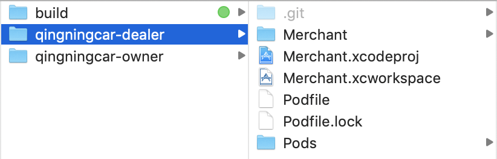
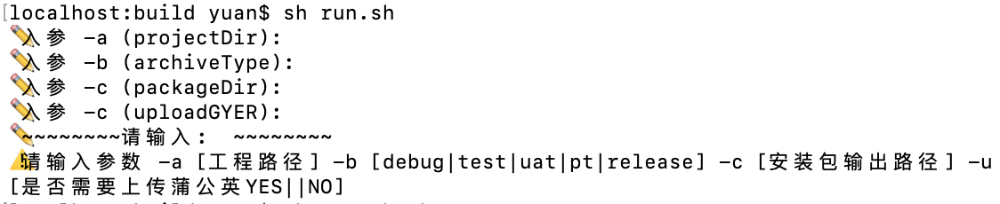
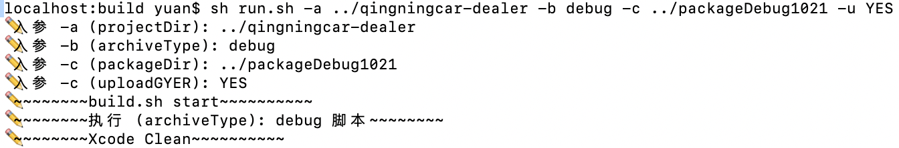
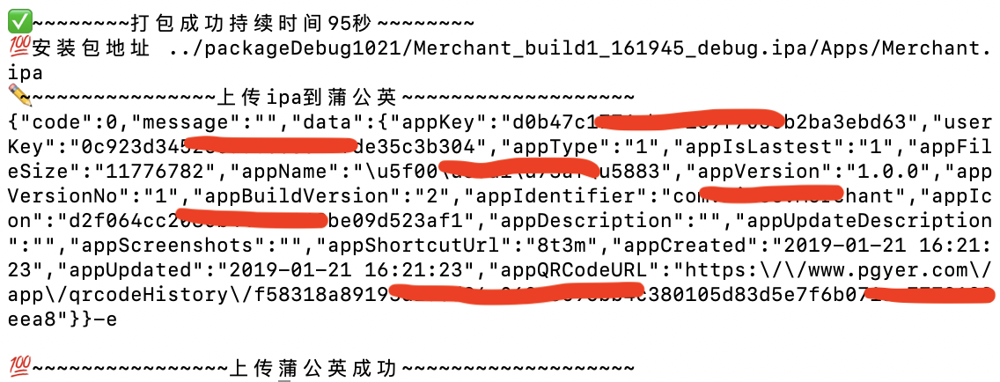
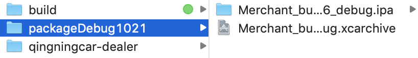

#关于iOS打包脚本的整理
-
> 前言：
> 一直想写这篇文章，又觉得自己才疏学浅，误人子弟。之前项目中也用过`jenkins`，`fastlane`这些工具，但是对于初学者，搭建环境依赖什么的个人觉得还是会繁琐些，不是说不能用，只是个人觉得还是不方便，用的不爽。。。于是今天做好了准备，分享一个自己在用的工具，介绍下使用方法，希望能帮助到正在学习的你，喜欢给个小✨✨是你给我最大的鼓励，谢谢！

###【注意】build和项目同级目录

1、选择脚本路径
<pre>
<code>cd build</code>
</pre>

2、参数介绍

3、执行脚本

4、结果

###【补充】针对各环境的不同，输出示例，供参考
1、 开发环境
<pre>
<code>sh run.sh -a ../qingningcar-dealer -b debug -c ../开发 -u NO</code>
</pre>

2、 测试环境
<pre>
<code>sh run.sh -a ../qingningcar-dealer -b test -c ../测试 -u NO</code>
</pre>

3、 UAT环境
<pre>
<code>sh run.sh -a ../qingningcar-dealer -b uat -c ../预发布 -u NO</code>
</pre>

4、 PT环境
<pre>
<code>sh run.sh -a ../qingningcar-dealer -b pt -c ../压测 -u NO</code>
</pre>

5、 生产环境
<pre>
<code>sh run.sh -a ../qingningcar-dealer -b release -c ../生产 -u NO</code>
</pre>

###【扩展】
理解脚本的使用，搭建持续集成平台`jenkins`，结合起来使用很方便，彻底解放双手，是时候对烦人没技术含量的事情说NO了，有兴趣的可以尝试下！
