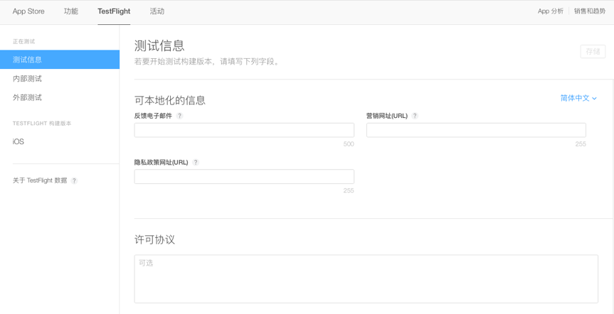
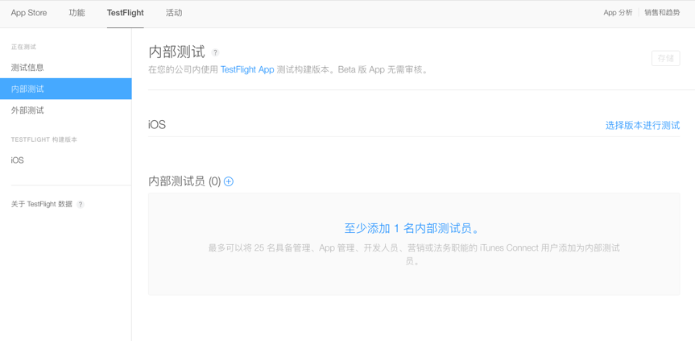
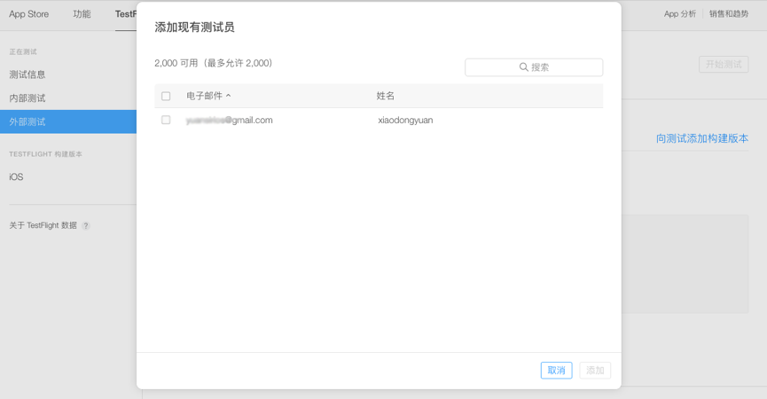
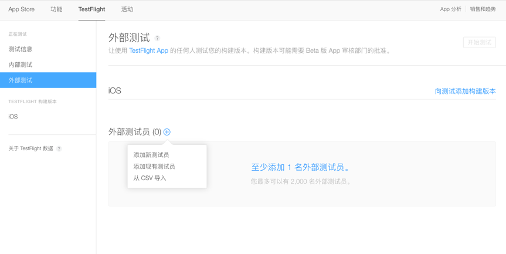
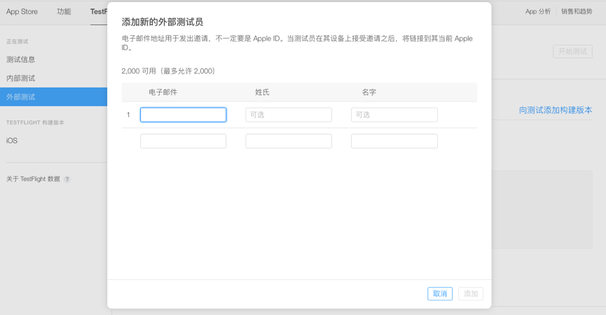
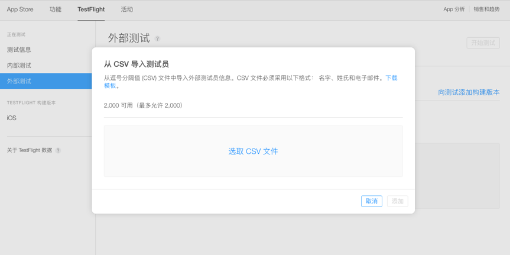
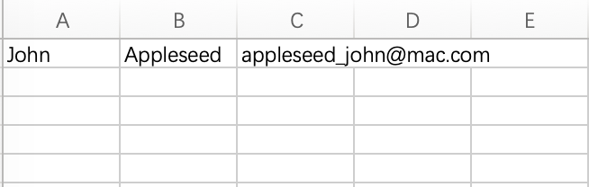
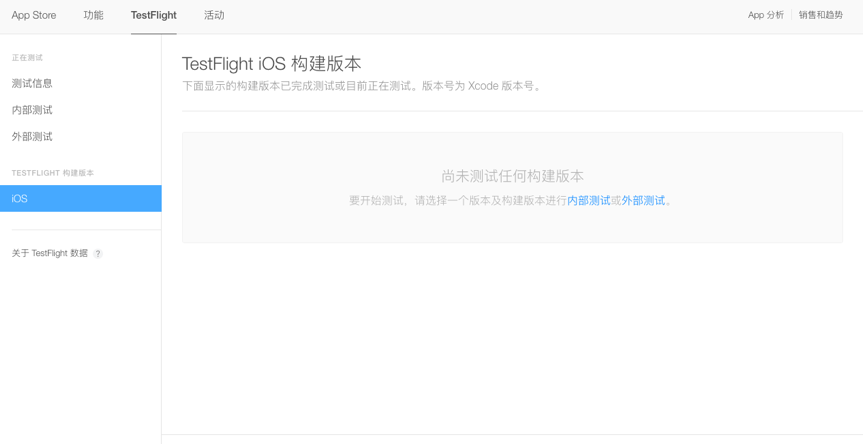
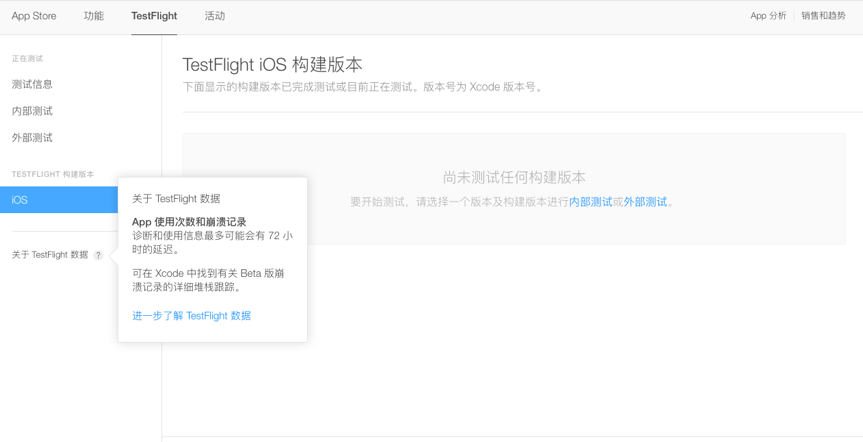
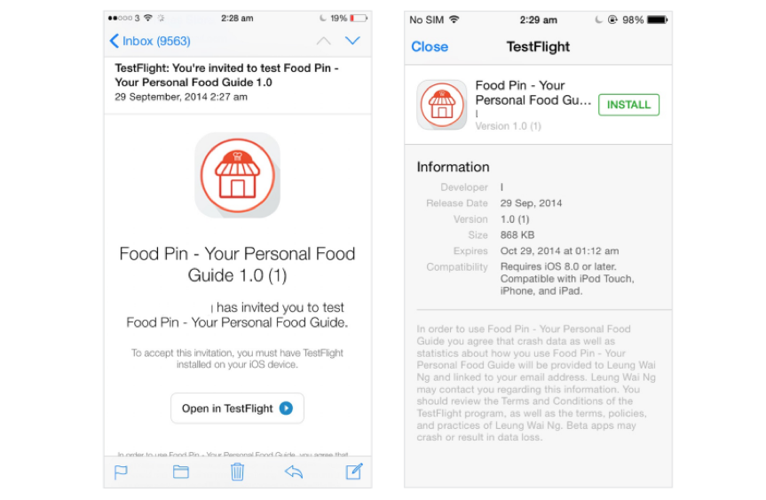

# 关于TestFlight的操作整理

[官方网站](https://developer.apple.com/testflight/)

[FAQ](https://itunespartner.apple.com/en/apps/faq/TestFlight%20Beta%20Testing_Overview)

1. 完善测试信息
   
   
2. 添加内部测试人员，最多25人
	
	
3. 指iTunes Connect上在你的开发团队里参与技术开发或者管理的成员（Agent、Admins、Members）
	
	
4. 添加外部测试人员，最多2000人（添加完成点击“开始测试”即可）
	
	
	添加新测试人员
	
	
	添加现有测试人员
	
	
	从CVS导入测试人员
	
	
	从逗号分隔值 (CSV) 文件中导入外部测试员信息。CSV 文件必须采	用以下格式： 名字、姓氏和电子邮件。  
	附件：`tester_impost.csv`
	
	
	
5. 构建iOS版本
	
	
6. 进一步了解TestFlight 数据
	
	
**注意事项：**  
测试用户需要在iPhone上下载TestFlight客户端，然后在邮件客户端中打开邮件，接受邀请，跳转下载。如果在mac或者pc上打开邮件点击接受邀请是没用的。 

**示例**  
如下图，测试者只需要点击Open TestFlight按钮就会自动的打开TestFlight应用(如果没有需要先安装)，之后就可以安装你的App的Beta版本，测试人员会一直收到你之后的每次更新。

**总结：**  

1. 25个内部测试账号 
2. 2000个外部测试账号 
3. 60天测试时间 
4. 测试版本可持续更新 
5. 后台随时可以停止测试 
6. iOS8之后才支持 

