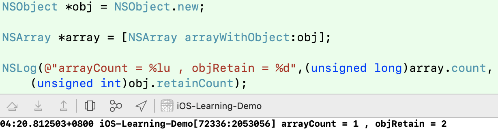
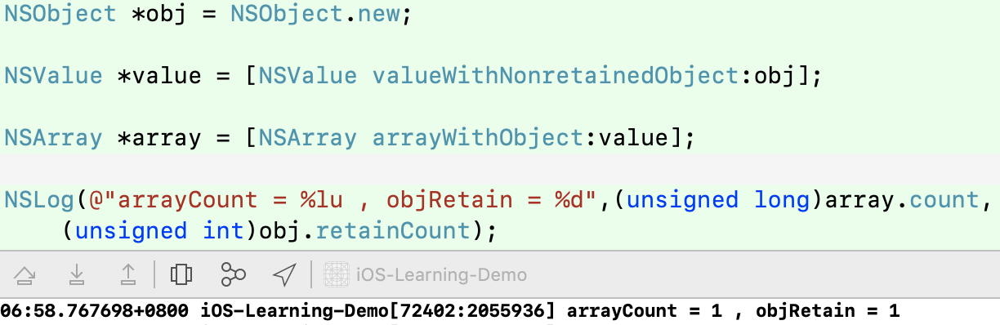
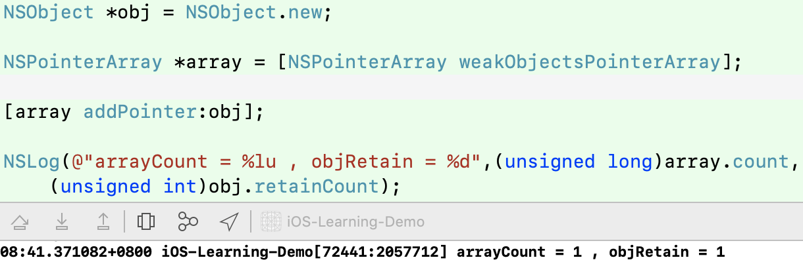
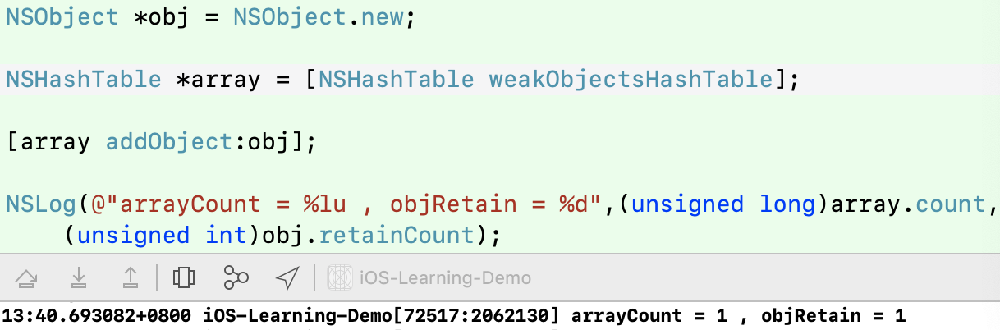
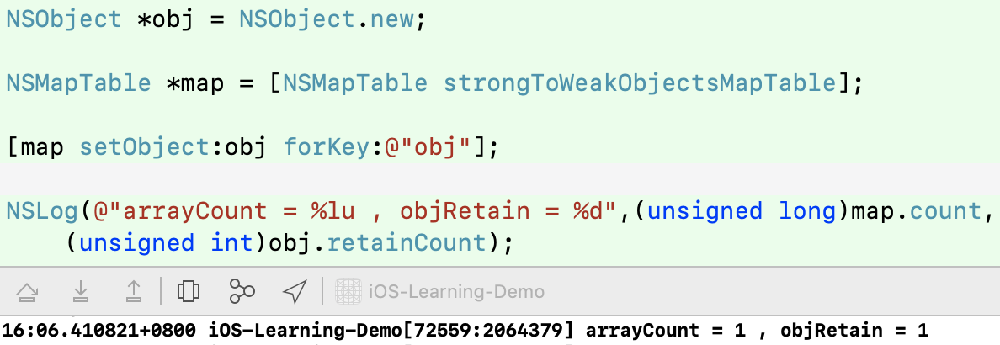
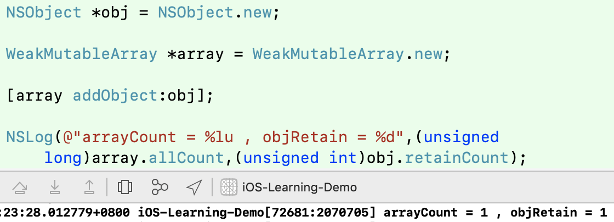

数组（字典）中添加弱引用；NSValue、NSPointerArray、NSHashTable、NSMapTable、WeakMutableArray

>也许你对NSArray使用了如指掌,每个加入到NSArry的对象都会被NSArray强持有。有时候,这种特性不是我们想要的结果。
有时候,我们想将对象存储起来,但是不想让数组增加了这个对象的引用计数,这个时候,WeakMutableArray才是你想要的。




#### 方法一：NSValue
iOS6.0之前，可以用[NSValue valueWithNonretainedObject:person]获取到对象的value，将这个value添加到数组中。效果如下：



#### 方法二：NSPointerArray
在iOS6.0之后出现了NSPointerArray。 
他的初始化方法，可以创建强引用，弱引用对象的数组

```
+ (NSPointerArray *)strongObjectsPointerArray NS_AVAILABLE(10_8, 6_0);
+ (NSPointerArray *)weakObjectsPointerArray NS_AVAILABLE(10_8, 6_0);
```



>同样，在iOS6.0之后 
有NSHashTable类似于NSSet 
有NSMapTable为NSDictionary 
具体使用方法可以参考API

#### 方法三：NSHashTable



#### 方法四：NSMapTable


#### 方法五：WeakMutableArray



