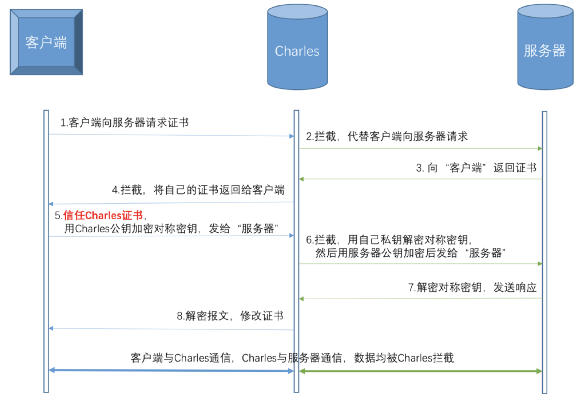

#### Charles抓取https数据的原理，如何防止中间人攻击

`Charles`作为一个“中间人代理”，当浏览器和服务器通信时，`Charles`接收服务器的证书，但动态生成一张证书发送给浏览器，也就是说`Charles`作为中间代理在浏览器和服务器之间通信，所以通信的数据可以被`Charles`拦截并解密。由于`Charles`更改了证书，浏览器校验不通过会给出安全警告，必须安装`Charles`的证书后才能进行正常访问。

下面来看具体的流程：



1. 客户端向服务器发起`HTTPS`请求

2. `Charles`拦截客户端的请求，伪装成客户端向服务器进行请求
3. 服务器向“客户端”（实际上是`Charles`）返回服务器的CA证书
4. `Charles`拦截服务器的响应，获取服务器证书公钥，然后自己制作一张证书，将服务器证书替换后发送给客户端。（`Charles`拿到了服务器证书的公钥）
5. 客户端接收到“服务器”（实际上是`Charles`）的证书后，生成一个对称密钥，用`Charles`的公钥加密，发送给“服务器”（实际上是`Charles`）
6. `Charles`拦截客户端的响应，用自己的私钥解密对称密钥，然后用服务器证书公钥加密，发送给服务器。（这一步，`Charles`拿到了对称密钥）
7. 服务器用自己的私钥解密对称密钥，向“客户端”（实际上是`Charles`）发送响应
8. `Charles`拦截服务器的响应，替换成自己的证书后发送给客户端
9. 至此，连接建立，Charles拿到了 **服务器证书的公钥** 和 **客户端与服务器协商的对称密钥**，之后就可以解密或者修改加密的报文了。

-----

##### 问题1：客户端是如何判断该证书是有效的呢？

这就是我们执行【在电脑上安装Charles根证书】或【移动端安装Charles根证书】的理由了。`CA证书`认证链的终点是根证书，如果能证明该证书的颁发机构的根位于系统根证书列表内，则说明该证书就是有效的。

其实即使我们不在客户端安装`Charles`根证书，仅仅执行【指定需要解析的Https请求】这一步也是可以抓取`Https`数据的。

但此时客户端会发出警告信息，选择忽视警告继续访问就可以了。

这种情况也有例外，如果服务端Https使用 [HSTS](https://baike.baidu.com/item/HSTS/8665782?fr=aladdin) 规则的话，当证书不被系统信任时，连接是不会创建成功的。

##### 问题2：如何防止Charles抓取https数据？

>1、当网络请求的时候,客户端判断当前环境是否设置了代理，如果设置代理,不允许进行访问。**(微信浏览器里面设置了代理，公众号等信息就都不允许查看了，无法访问，原理类似)** 

参考检测代理方法

```
+ (BOOL)getProxyStatus {
    NSDictionary *proxySettings = NSMakeCollectable([(NSDictionary *)CFNetworkCopySystemProxySettings() autorelease]);
    NSArray *proxies = NSMakeCollectable([(NSArray *)CFNetworkCopyProxiesForURL((CFURLRef)[NSURL URLWithString:@"https://www.google.com"], (CFDictionaryRef)proxySettings) autorelease]);
    NSDictionary *settings = [proxies objectAtIndex:0];
    
    NSLog(@"host=%@", [settings objectForKey:(NSString *)kCFProxyHostNameKey]);
    NSLog(@"port=%@", [settings objectForKey:(NSString *)kCFProxyPortNumberKey]);
    NSLog(@"type=%@", [settings objectForKey:(NSString *)kCFProxyTypeKey]);
    
    if ([[settings objectForKey:(NSString *)kCFProxyTypeKey] isEqualToString:@"kCFProxyTypeNone"]){
        return NO;
    }else{
        return YES;
    }
}

```

>2、客户端本地做证书校验,并且设置不仅仅校验公钥,设置完整的正式校验模式

```
+(AFSecurityPolicy*)customSecurityPolicy
{
    //先导入证书
    NSString *cerPath = [[NSBundle mainBundle] pathForResource:@"证书" ofType:@"cer"];
    NSData *certData = [NSData dataWithContentsOfFile:cerPath];
    // AFSSLPinningModeCertificate 使用证书验证模式 (AFSSLPinningModeCertificate是证书所有字段都一样才通过认证，AFSSLPinningModePublicKey只认证公钥那一段，AFSSLPinningModeCertificate更安全。但是单向认证不能防止“中间人攻击”)
    AFSecurityPolicy *securityPolicy = [AFSecurityPolicy policyWithPinningMode:AFSSLPinningModeCertificate];
    // allowInvalidCertificates 是否允许无效证书（也就是自建的证书），默认为NO
    // 如果是需要验证自建证书，需要设置为YES
    securityPolicy.allowInvalidCertificates = YES;

    //validatesDomainName 是否需要验证域名，默认为YES；
    //假如证书的域名与你请求的域名不一致，需把该项设置为NO；如设成NO的话，即服务器使用其他可信任机构颁发的证书，也可以建立连接，这个非常危险，建议打开。

    //置为NO，主要用于这种情况：客户端请求的是子域名，而证书上的是另外一个域名。因为SSL证书上的域名是独立的，假如证书上注册的域名是www.google.com，那么mail.google.com是无法验证通过的；当然，有钱可以注册通配符的域名*.google.com，但这个还是比较贵的。
    //如置为NO，建议自己添加对应域名的校验逻辑。
    securityPolicy.validatesDomainName = YES;
    NSSet<NSData*> * set = [[NSSet alloc]initWithObjects:certData  , nil];
    securityPolicy.pinnedCertificates = set;
     
    return securityPolicy;
}

```

>3、客户端不要轻易信任证书

**以上设置，会校验请求的时候不仅仅校验域名,会将证书中的公钥及其他信息也进行校验，中间人伪造的证书就无法通过验证,无法进行抓包。**

以上资料结合自己理解和资料，供参考，谢谢！

参考资料

[浅谈Charles抓取HTTPS原理](https://www.jianshu.com/p/405f9d76f8c4) 

[iOS 如何防止https抓包](https://www.jianshu.com/p/4682aecf162d?open_source=weibo_search)