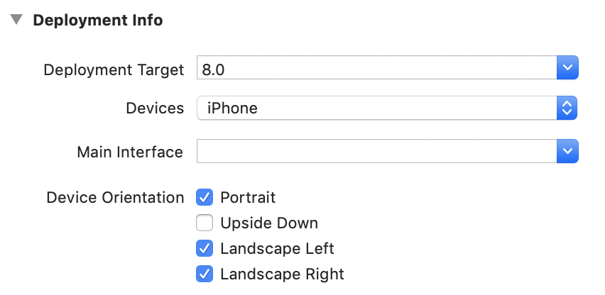
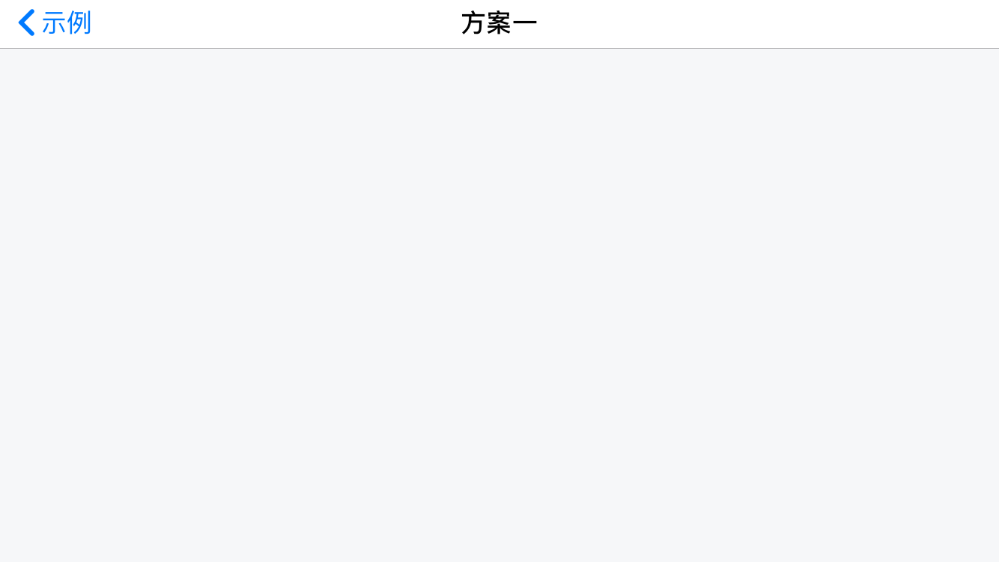
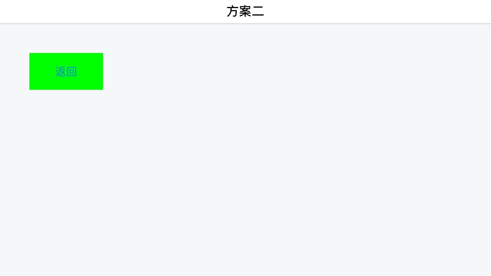

## iOS开发中个别页面横屏操作实战

>iOS开发中常见的显示模式为竖屏，就是说不能旋转。当然也有旋转的需求，比如像阅读类，证券类，视频类App中会涉及到页面旋转，因为项目之前也没接触到，今天兴致上来了就看了下，实践一把，把各个关键流程写出来总结给大家，希望能帮到有需要的朋友。

#### 第一步：正确的工程配置

这边的设置是允许各方向旋转，不明白的可以自己尝试下



#### 方案一

创建`UINavigationController`基类，比如我这边创建的

```
#import <UIKit/UIKit.h>

NS_ASSUME_NONNULL_BEGIN

@interface YSBaseNavigationController : UINavigationController

@end

NS_ASSUME_NONNULL_END

```

打开`YSBaseNavigationController.m`文件，添加如下代码：

```
- (BOOL)shouldAutorotate{
    return [self.topViewController shouldAutorotate];
}

- (UIInterfaceOrientationMask)supportedInterfaceOrientations {
    return [self.topViewController supportedInterfaceOrientations];
}
```

进入需要旋转的控制器文件，示例文件为`YSVedioViewController`
添加如下代码：

```

- (void)viewWillAppear:(BOOL)animated{
    
    [super viewWillAppear:animated];
    
    //进入旋转
    [self changeRotate:YES];
    
}

- (void)viewDidDisappear:(BOOL)animated{
    
    [super viewDidDisappear:animated];
    
    //退出恢复
    [self changeRotate:NO];
    
}

/*
 *iOS中可以直接调用对象的消息方式有两种
 *以下方式是KVO的变相实现，有兴趣可以尝试下
 *原理都是操作UIDevice的orientation属性，达到旋转
 
 *1.performSelector:withObject;
 
 *2.NSInvocation
 
 if([[UIDevice currentDevice]respondsToSelector:@selector(setOrientation:)]) {
    SEL selector = NSSelectorFromString(@"setOrientation:");
    NSInvocation *invocation = [NSInvocation invocationWithMethodSignature:[UIDevice instanceMethodSignatureForSelector:selector]];
    [invocation setSelector:selector];
    [invocation setTarget:[UIDevice currentDevice]];
    int val = UIInterfaceOrientationPortrait;
    if (change) {
        val = UIInterfaceOrientationLandscapeRight;
    }
    [invocation setArgument:&val atIndex:2];
    [invocation invoke];
 }
 */

- (void)changeRotate:(BOOL)change{
    
    /*
     *采用KVO字段控制旋转
     */
    
    NSNumber *orientationUnknown = [NSNumber numberWithInt:UIInterfaceOrientationUnknown];
    
    [[UIDevice currentDevice] setValue:orientationUnknown forKey:@"orientation"];
    
    NSNumber *orientationTarget = [NSNumber numberWithInt:UIInterfaceOrientationPortrait];
    
    if (change) {
        orientationTarget = [NSNumber numberWithInt:UIInterfaceOrientationLandscapeRight];
    }
    
    [[UIDevice currentDevice] setValue:orientationTarget forKey:@"orientation"];
}

#pragma mark - *********** 旋转设置 ***********

- (BOOL)shouldAutorotate{
    return YES;
}

- (UIInterfaceOrientationMask)supportedInterfaceOrientations{
    return UIInterfaceOrientationMaskLandscapeRight;
}

```

调用方式

```
YSVedioViewController *vc = YSVedioViewController.new;
[self.navigationController pushViewController:vc animated:YES];
```

效果图



#### 方案二

创建`UIViewController`基类，比如我这边创建的

```
#import <UIKit/UIKit.h>

NS_ASSUME_NONNULL_BEGIN

@interface YSBaseViewController : UIViewController

@end

NS_ASSUME_NONNULL_END
```

打开`YSBaseViewController `文件，写上如下代码：

```
//支持旋转
- (BOOL)shouldAutorotate{
    return YES;
}

//默认只需要支持竖屏
- (UIInterfaceOrientationMask)supportedInterfaceOrientations {
    return UIInterfaceOrientationMaskPortrait;
}
```

进入需要旋转的控制器文件，示例文件为`YSRotateViewController`
添加如下代码：

```
#pragma mark - *********** 旋转设置 ***********

//支持的方向
- (UIInterfaceOrientationMask)supportedInterfaceOrientations {
    return UIInterfaceOrientationMaskLandscapeRight;
}

//刚开始的方向
- (UIInterfaceOrientation)preferredInterfaceOrientationForPresentation{
    return UIInterfaceOrientationLandscapeRight;
}
```

调用方式

```
YSRotateViewController *vc = [[YSRotateViewController alloc]init];
YSBaseNavigationController *nv = [[YSBaseNavigationController alloc]initWithRootViewController:vc];
[self presentViewController:nv animated:YES completion:nil];
```

效果图



**[注]**方案二的实现只适用于模态视图