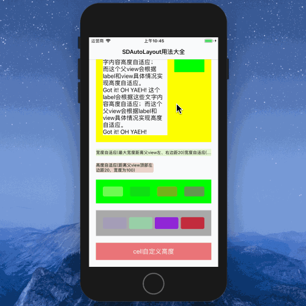

## SDAutoLayout使用介绍

[SDAutoLayout](https://github.com/gsdios/SDAutoLayout)
是一款优秀的自动布局框架，大家或多或少对它有点了解，今天总结下它的基本使用方法，希望对大家能有点帮助

>项目示例



#### 1、基本布局

```
{
    //1、填充一个和父视图一样的滚动视图
    [self.view addSubview:self.listView];
    self.listView.sd_layout
    .spaceToSuperView(UIEdgeInsetsMake(0, 0, 0, 0));
    
    //2、左、上20，长50，宽100
    UIView *view1 = [UIView new];
    view1.backgroundColor = UIColor.redColor;
    [self.listView addSubview:view1];
    view1.sd_layout
    .topSpaceToView(self.listView, 20)
    .leftSpaceToView(self.listView,20)
    .heightIs(100)
    .widthIs(200);
    
    //3、长宽为view1一半，
    UIView *view2 = [UIView new];
    view2.backgroundColor = UIColor.greenColor;
    [self.listView addSubview:view2];
    view2.sd_layout
    .heightRatioToView(view1,.5)
    .widthRatioToView(view1,.5)
    .centerYEqualToView(view1)
    .centerXEqualToView(view1);
    
    //4、距离view1为20，距离右侧屏幕20，顶部、高度和view一样
    UIView *view3 = [UIView new];
    view3.backgroundColor = UIColor.blueColor;
    [self.listView addSubview:view3];
    view3.sd_layout
    .topEqualToView(view1)
    .leftSpaceToView(view1, 20)
    .rightSpaceToView(self.listView, 20)
    .heightIs(view1.height_sd);
}
```

#### 2、label的父视图根据label的高度自适应

```
{
    UILabel *label1 = [UILabel new];
    label1.text = @"这个label会根据这些文字内容高度自适应；\n而这个父view会根据label和view具体情况实现高度自适应。\nGot it! OH YAEH! 这个label会根据这些文字内容高度自适应；而这个父view会根据label和view具体情况实现高度自适应。\nGot it! OH YAEH!";
    label1.backgroundColor = UIColor.whiteColor;
    
    UILabel *label2 = UILabel.new;
    label2.backgroundColor = UIColor.greenColor;
    
    UIView *view4 = [UIView new];
    view4.backgroundColor = UIColor.yellowColor;
    [self.listView addSubview:view4];
    [view4 sd_addSubviews:@[label1, label2]];
    
    label1.sd_layout
    .topSpaceToView(view4,20)
    .leftSpaceToView(view4, 20)
    .widthRatioToView(self.listView, .5)
    .autoHeightRatio(0);
    //设置文本内容自适应，如果这里的参数为大于0的数值则会以此数值作为view的高宽比设置view的高度
    
    label2.sd_layout
    .topEqualToView(label1)
    .leftSpaceToView(label1, 20)
    .rightSpaceToView(view4, 20)
    .heightIs(60);
    
    view4.sd_layout
    .leftSpaceToView(self.listView,20)
    .topSpaceToView(lastView, 20)
    .rightSpaceToView(self.listView,20);
    
    // [重点]设置view1高度根据子其内容自适应
    [view4 setupAutoHeightWithBottomView:label1 bottomMargin:20];
}
```

#### 3、label宽度自适应

```
{
    UILabel *autoWidthlabel = [UILabel new];
    autoWidthlabel.backgroundColor = randomColor;
    autoWidthlabel.font = [UIFont systemFontOfSize:12];
    autoWidthlabel.text = @"宽度自适应(最大宽度距离父view左、右边距20)宽度自适应(最大宽度距离父view左、右边距20)宽度自适应(最大宽度距离父view左、右边距20)";
    [self.listView addSubview:autoWidthlabel];
    
    autoWidthlabel.sd_layout
    .topSpaceToView(lastView, 20)
    .leftEqualToView(lastView)
    .heightIs(20);
    
    [autoWidthlabel setSingleLineAutoResizeWithMaxWidth:self.view.width - 20*2];
}
```

#### 4、label高度自适应

```
{
    UILabel *autoHeightlabel = [UILabel new];
    autoHeightlabel.backgroundColor = randomColor;
    autoHeightlabel.font = [UIFont systemFontOfSize:12];
    autoHeightlabel.text = @"高度自适应(距离父view顶部左边距20，宽度为100)";
    [self.listView addSubview:autoHeightlabel];
    
    autoHeightlabel.sd_layout
    .topSpaceToView(lastView, 20)
    .leftEqualToView(lastView)
    .widthRatioToView(lastView, .5)
    .autoHeightRatio(0);
    
    //设圆角
    autoHeightlabel.sd_cornerRadius = @(5);
}
```

**当然若你的控件是先加载控件，后填入内容就需要在重置内容后对控件进行重新布局：**

```
[view updateLayout];
```

**【注意】SDAutoLayout是延迟布局生效，不是你刚调用.sd_layout对控件进行布局后立即填充内容，它的宽度就是刚布局时的宽度。但是若控件已经加载出来，等大约1秒后你再对它赋值，那么你不对它重新布局，那么它显示的就是最开始的宽度。高度自适应也是如此。**

```
//需要在旋转重新设置
- (void)viewDidLayoutSubviews{
    [super viewDidLayoutSubviews];
    [_autoWidthlabel setSingleLineAutoResizeWithMaxWidth:self.view.width - 20*2];
}
```

#### 5、设置一排固定间距自动宽度子view

```
{
	NSInteger count = 4;
    CGFloat margin = 20;
    
    //放button的父视图
    UIView *autoWidthViewsContainer = [UIView new]; 
    
    autoWidthViewsContainer.backgroundColor = [UIColor greenColor];
    
    [self.listView addSubview:autoWidthViewsContainer];
    
    NSMutableArray *temp = [NSMutableArray new];
    
    for (int i = 0; i < count; i++) {
        
        UIView *view = [UIView new];
        
        view.backgroundColor = randomColor;
        
        [autoWidthViewsContainer addSubview:view];
        
        // 设置高度约束，长宽比
        view.sd_layout.autoHeightRatio(.5);
        view.sd_cornerRadius = @(5);
        
        [temp addObject:view];
        
    }
    
    autoWidthViewsContainer.sd_layout
    .leftSpaceToView(self.listView, 20)
    .rightSpaceToView(self.listView,20)
    .topSpaceToView(lastView,20);
    
    // 此步设置之后autoWidthViewsContainer的高度可以根据子view自适应
    [autoWidthViewsContainer setupAutoWidthFlowItems:[temp copy]
                                withPerRowItemsCount:count
                                      verticalMargin:margin
                                    horizontalMargin:margin
                                   verticalEdgeInset:margin
                                 horizontalEdgeInset:margin];
    
    lastView = autoWidthViewsContainer;
}
```

#### 6、设置一排固定宽度自动间距子view

```
{
    NSInteger count = 4;
    CGFloat margin = 20;
    CGFloat itemWidth = (self.view.width_sd - 20*2 - (count - 1)*20)/count;
    
    UIView *autoMarginViewsContainer = [UIView new];
    
    autoMarginViewsContainer.backgroundColor = [UIColor lightGrayColor];
    
    [self.listView addSubview:autoMarginViewsContainer];
    
    NSMutableArray *temp = [NSMutableArray new];
    
    for (int i =0; i < count; i++) {
        
        UIView *view = [UIView new];
        
        view.backgroundColor = randomColor;
        
        [autoMarginViewsContainer addSubview:view];
        
        view.sd_layout.autoHeightRatio(0.5);
        view.sd_cornerRadius = @(5);
        
        [temp addObject:view];
        
    }
    
    autoMarginViewsContainer.sd_layout
    .leftSpaceToView(self.listView, 20)
    .rightSpaceToView(self.listView, 20)
    .topSpaceToView(lastView, 20);
    
    //此步设置之后autoMarginViewsContainer的高度可以根据子view自适应
    [autoMarginViewsContainer setupAutoMarginFlowItems:[temp copy] withPerRowItemsCount:count itemWidth:itemWidth verticalMargin:margin verticalEdgeInset:margin horizontalEdgeInset:margin];
    
    lastView = autoMarginViewsContainer;
}
```

#### 7、设置UIScrollView

* bottomView设置最后一个视图即可

```
[self.listView setupAutoContentSizeWithBottomView:lastView bottomMargin:20];
```

#### 8、cell自定义高度

>UITableView设置

* 设置行高

```
- (CGFloat)tableView:(UITableView *)tableView heightForRowAtIndexPath:(NSIndexPath *)indexPath{
    return [self.listTableView cellHeightForIndexPath:indexPath model:_itemList[indexPath.row] keyPath:@"title" cellClass:[SDTabelViewCell class] contentViewWidth:[self cellContentViewWith]];
}

- (CGFloat)cellContentViewWith{
    CGFloat width = [UIScreen mainScreen].bounds.size.width;
    // 适配ios7横屏
    if ([UIApplication sharedApplication].statusBarOrientation != UIInterfaceOrientationPortrait && [[UIDevice currentDevice].systemVersion floatValue] < 8) {
        width = [UIScreen mainScreen].bounds.size.height;
    }
    return width;
}
```

>UITableViewCell设置

* 设置布局

```
self.titleLabel.sd_layout
    .topSpaceToView(self.contentView, 20)
    .leftSpaceToView(self.contentView, 20)
    .widthRatioToView(self.contentView, .5)
    .autoHeightRatio(0);
```

* 设置cell高度

```
[self setupAutoHeightWithBottomView:self.titleLabel bottomMargin:20];
```

### 总结

* 框架使用方便简单，链式设计值得参考
* 介绍了一些基本使用，还有很多方便的API值得大家挖掘，多看源码，多思考架构思想，让自己的代码写得更加精简
* 正在使用的朋友多交流经验技巧

以上均是自学过程的积累，学到哪记到哪

原创文章，转载请注明出处，谢谢！