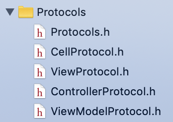
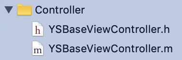
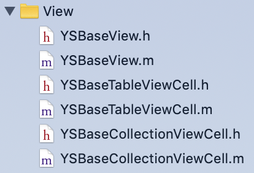
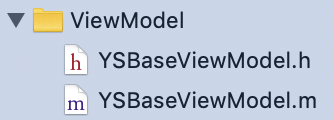
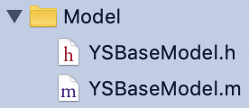
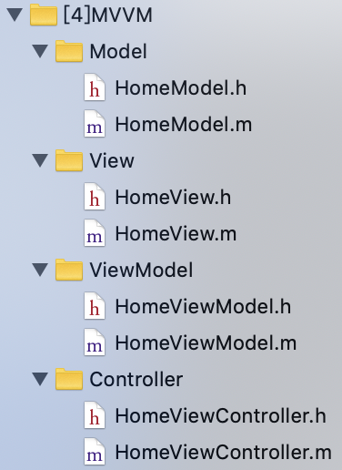
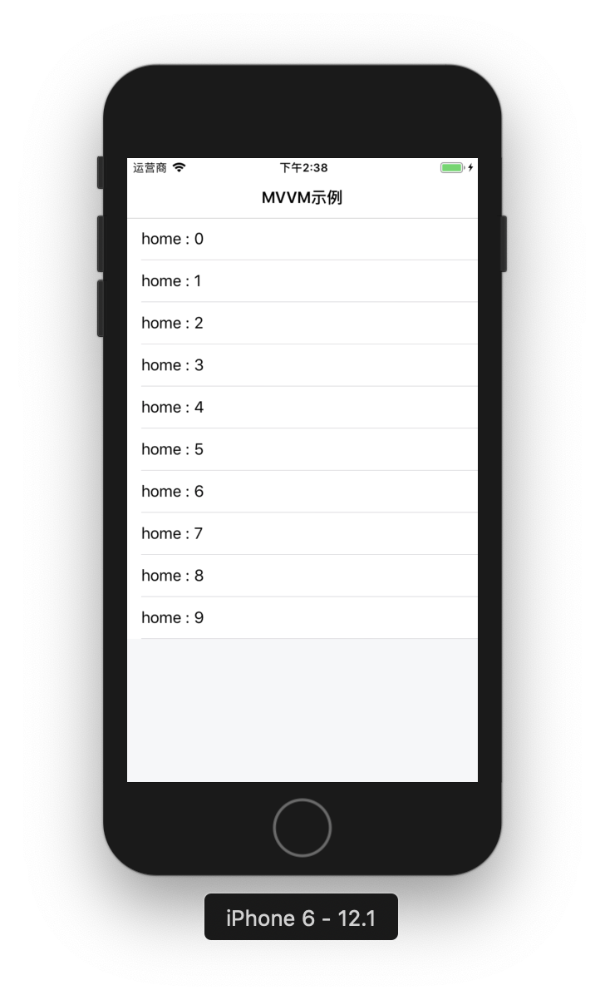

## 基于MVVM+RAC架构实践

### 一、基类构建

>Protocols模块



* Protocols.h

```
#import "CellProtocol.h"
#import "ViewProtocol.h"
#import "ViewModelProtocol.h"
#import "ControllerProtocol.h"
```

* CellProtocol.h

```
@protocol CellProtocol <NSObject>

@optional

/*
 * 初始化UI控件
 */
- (void)setupViews;

@end
```

* ViewProtocol.h

```
@protocol ViewModelProtocol;

@protocol ViewProtocol <NSObject>

@optional

- (instancetype)initWithViewModel:(id<ViewModelProtocol>)viewModel;
/**
 * 初始化UI控件
 */
- (void)setupViews;
/**
 * 初始化RAC
 */
- (void)racViewModel;

@end
```

* ControllerProtocol.h

```
@protocol ViewModelProtocol;

@protocol ControllerProtocol <NSObject>

@optional

- (instancetype)initWithViewModel:(id <ViewModelProtocol>)viewModel;
/*
 * 初始化UI控件
 */
- (void)addSubviews;
/*
 * 初始化RAC
 */
- (void)racViewModel;
/*
 * 初始化导航栏
 */
- (void)layoutNavigation;

@end
```

* ViewModelProtocol.h

```
@protocol ViewModelProtocol <NSObject>

@optional

- (instancetype)initWithModel:(id)model;

/**
 *  初始化
 */
- (void)initialize;

@end
```

> View模块



* YSBaseViewController.h

```
#import <UIKit/UIKit.h>
#import "ControllerProtocol.h"

NS_ASSUME_NONNULL_BEGIN

@interface YSBaseViewController : UIViewController<ControllerProtocol>

@end

NS_ASSUME_NONNULL_END
```

* YSBaseViewController.m

```
#import "YSBaseViewController.h"

@interface YSBaseViewController ()

@end

@implementation YSBaseViewController

+ (instancetype)allocWithZone:(struct _NSZone *)zone{
    YSBaseViewController *viewController = [super allocWithZone:zone];
    @weakify(viewController)
    [[viewController rac_signalForSelector:@selector(viewDidLoad)] subscribeNext:^(id x) {
        @strongify(viewController)
        [viewController layoutNavigation];
        [viewController addSubviews];
        [viewController racViewModel];
    }];
    return viewController;
}

- (instancetype)initWithViewModel:(id <ViewModelProtocol>)viewModel{
    if (self = [super init]) {
    }
    return self;
}

- (void)addSubviews{
    self.view.backgroundColor = UIColorViewBG;
}

- (void)racViewModel{}

- (void)layoutNavigation{
    [self setLeftBarButtonWithTitle:nil];
}

- (void)viewDidLoad {
    [super viewDidLoad];
    dispatch_after(dispatch_time(DISPATCH_TIME_NOW, (int64_t)(1 * NSEC_PER_SEC)), dispatch_get_main_queue(), ^{
        NSLog(@"当前控制器 ---   %@  --- ",NSStringFromClass([self class]));
    });
}

- (void)dealloc{
    NSLog(@"VC -- %@ -- 正常销毁",NSStringFromClass([self class]));
}

@end
```

> View模块



* YSBaseView.h

```
#import <UIKit/UIKit.h>
#import "ViewProtocol.h"

NS_ASSUME_NONNULL_BEGIN

@interface YSBaseView : UIView<ViewProtocol>

@end

NS_ASSUME_NONNULL_END
```

* YSBaseView.m

```
#import "YSBaseView.h"

@implementation YSBaseView

- (instancetype)init{
    if (self = [super init]) {
        [self racViewModel];
        [self setupViews];
    }
    return self;
}

- (instancetype)initWithViewModel:(id<ViewModelProtocol>)viewModel{
    if (self = [super init]) {
        [self racViewModel];
        [self setupViews];
    }
    return self;
}

- (void)bindViewModel{}

- (void)setupViews{}

- (void)dealloc{
    NSLog(@"YSBaseView -- %@ -- 正常销毁",NSStringFromClass([self class]));
}

@end
```

* YSBaseTableViewCell.h

```
#import <UIKit/UIKit.h>
#import "CellProtocol.h"

NS_ASSUME_NONNULL_BEGIN

@interface YSBaseTableViewCell : UITableViewCell<CellProtocol>

@end

NS_ASSUME_NONNULL_END
```

* YSBaseTableViewCell.m

```
#import "YSBaseTableViewCell.h"

@implementation YSBaseTableViewCell

- (void)awakeFromNib {
    [super awakeFromNib];
}

- (void)setSelected:(BOOL)selected animated:(BOOL)animated {
    [super setSelected:selected animated:animated];
}

- (instancetype)initWithStyle:(UITableViewCellStyle)style reuseIdentifier:(NSString *)reuseIdentifier {
    if (self = [super initWithStyle:style reuseIdentifier:reuseIdentifier]) {
        [self setupViews];
    }
    return self;
}

- (void)setupViews{}

- (void)dealloc{
    NSLog(@"YSBaseTableViewCell -- %@ -- 正常销毁",NSStringFromClass([self class]));
}

@end
```

* YSBaseCollectionViewCell.h

```
#import <UIKit/UIKit.h>
#import "CellProtocol.h"

NS_ASSUME_NONNULL_BEGIN

@interface YSBaseCollectionViewCell : UICollectionViewCell<CellProtocol>

@end

NS_ASSUME_NONNULL_END
```

* YSBaseCollectionViewCell.m

```
#import "YSBaseCollectionViewCell.h"

@implementation YSBaseCollectionViewCell

- (instancetype)initWithFrame:(CGRect)frame{
    if (self = [super initWithFrame:frame]){
        [self setupViews];
    }
    return self;
}

- (void)setupViews{}

- (void)dealloc{
    NSLog(@"YSBaseCollectionViewCell -- %@ -- 正常销毁",NSStringFromClass([self class]));
}

@end
```

> ViewModel模块



* YSBaseViewModel.h

```
#import <Foundation/Foundation.h>
#import "ViewModelProtocol.h"

NS_ASSUME_NONNULL_BEGIN

@interface YSBaseViewModel : NSObject<ViewModelProtocol>

@end

NS_ASSUME_NONNULL_END
```

* YSBaseViewModel.m

```

#import "YSBaseViewModel.h"

@implementation YSBaseViewModel

+ (instancetype)allocWithZone:(struct _NSZone *)zone {
    YSBaseViewModel *viewModel = [super allocWithZone:zone];
    if (viewModel) {
        [viewModel initialize];
    }
    return viewModel;
}

- (instancetype)initWithModel:(id)model {
    if (self = [super init]) {
    }
    return self;
}

- (void)initialize{
    
}

@end
```

> Model模块



* YSBaseModel.h

```
#import <Foundation/Foundation.h>

NS_ASSUME_NONNULL_BEGIN

@interface YSBaseModel : NSObject

@end

NS_ASSUME_NONNULL_END
```

* YSBaseModel.m

```
#import "YSBaseModel.h"
#include <objc/runtime.h>

@implementation YSBaseModel

- (NSString *)debugDescription{
    return [self description];
}

- (NSString *)description{
    if ([self isKindOfClass:[NSArray class]] || [self isKindOfClass:[NSDictionary class]] || [self isKindOfClass:[NSNumber class]] || [self isKindOfClass:[NSString class]])
    {
        return self.debugDescription;
    }
    NSMutableDictionary *dictionary = [NSMutableDictionary dictionary];
    uint count;
    objc_property_t *properties = class_copyPropertyList([self class], &count);
    for (int i = 0; i < count; i++)
    {
        objc_property_t property = properties[i];
        NSString *name = @(property_getName(property));
        id value = [self valueForKey:name]?:@"nil";
        [dictionary setObject:value forKey:name];
    }
    free(properties);
    return [NSString stringWithFormat:@"<%@: %p> -- %@", [self class], self, dictionary];
}

- (void)dealloc{
    NSLog(@"YSBaseModel -- %@ -- 正常销毁",NSStringFromClass([self class]));
}

@end
```

### 二、实践示例

>模块结构



* HomeModel.h

```
#import "YSBaseModel.h"

NS_ASSUME_NONNULL_BEGIN

@interface HomeModel : YSBaseModel

@property (nonatomic,copy) NSString *title;

@end

NS_ASSUME_NONNULL_END
```

* HomeModel.m

```
#import "HomeModel.h"

@implementation HomeModel

@end
```

* HomeView.h

```
#import "YSBaseView.h"

NS_ASSUME_NONNULL_BEGIN

@interface HomeView : YSBaseView

@end

NS_ASSUME_NONNULL_END
```

* HomeView.m

```
#import "HomeView.h"
#import "HomeViewModel.h"

@interface HomeView()<UITableViewDataSource,UITableViewDelegate>

@property (nonatomic,strong) UITableView *homeTableView;
@property (nonatomic,strong) HomeViewModel *homeViewModel;

@end

@implementation HomeView

- (instancetype)initWithViewModel:(id<ViewModelProtocol>)viewModel{
    self.homeViewModel = (HomeViewModel *)viewModel;
    return [super initWithViewModel:viewModel];
}

#pragma mark - *********** initViews ***********

- (void)setupViews{
    [self addSubview:self.homeTableView];
    self.homeTableView
    .sd_layout
    .spaceToSuperView(UIEdgeInsetsMake(0, 0, 0, 0));
}

#pragma mark - *********** RAC ***********

- (void)racViewModel{
    @weakify(self)
    [[self.homeViewModel.loadDataSubject takeUntil:self.rac_willDeallocSignal] subscribeNext:^(id  _Nullable x) {
        @strongify(self)
        [self.homeTableView reloadData];
    }];
}
    
#pragma mark - *********** UITabelViewDelegate ***********

- (NSInteger)tableView:(UITableView *)tableView numberOfRowsInSection:(NSInteger)section{
    return self.homeViewModel.dataArray.count;
}

- (UITableViewCell *)tableView:(UITableView *)tableView cellForRowAtIndexPath:(NSIndexPath *)indexPath{
    static NSString *reuseIdetify = @"TableViewCell";
    UITableViewCell *cell = [tableView dequeueReusableCellWithIdentifier:reuseIdetify];
    if (!cell) {
        cell = [[UITableViewCell alloc] initWithStyle:UITableViewCellStyleDefault reuseIdentifier:reuseIdetify];
        cell.selectionStyle = UITableViewCellSelectionStyleNone;
    }
    
    HomeModel *model = self.homeViewModel.dataArray[indexPath.row];
    
    cell.textLabel.text = model.title;
    
    return cell;
}

#pragma mark - *********** lazy ***********

- (UITableView *)homeTableView{
    if (!_homeTableView) {
        _homeTableView = [[UITableView alloc] init];
        _homeTableView.backgroundColor = UIColorViewBG;
        _homeTableView.tableFooterView = [[UIView alloc] init];
        _homeTableView.dataSource = self;
        _homeTableView.delegate = self;
        
        if (@available(iOS 11.0, *)) {
            _homeTableView.contentInsetAdjustmentBehavior = UIScrollViewContentInsetAdjustmentNever;
        }
    }
    return _homeTableView;
}

- (HomeViewModel *)homeViewModel{
    if (!_homeViewModel) {
        _homeViewModel = [[HomeViewModel alloc] init];
    }
    return _homeViewModel;
}

@end
```

* HomeViewModel.h

```
#import "YSBaseViewModel.h"
#import "HomeModel.h"

NS_ASSUME_NONNULL_BEGIN

@interface HomeViewModel : YSBaseViewModel

@property (nonatomic,strong) RACSubject *loadDataSubject;
@property (nonatomic,strong) RACCommand *loadDataCommand;

@property (nonatomic,strong) NSMutableArray *dataArray;

@end

NS_ASSUME_NONNULL_END
```

* HomeViewModel.m

```
#import "HomeViewModel.h"

@implementation HomeViewModel

- (void)initialize{
    @weakify(self)
    [self.loadDataCommand.executionSignals.switchToLatest subscribeNext:^(id  _Nullable x) {
        @strongify(self)
        if (x == nil) {
            [self.loadDataSubject sendNext:nil];
            return;
        }
        if ([x[@"success"] boolValue]) {
            NSArray *arr = x[@"body"];
            if ([arr isKindOfClass:[NSArray class]]) {
                if (self.dataArray) {
                    [self.dataArray removeAllObjects];
                }
                [self.dataArray addObjectsFromArray:arr];
            }
            [self.loadDataSubject sendNext:@"请求成功"];
        }else{
            [self.loadDataSubject sendNext:@"请求失败"];
        }
    }];
}

- (RACCommand *)loadDataCommand{
    if (!_loadDataCommand) {
        _loadDataCommand = [[RACCommand alloc] initWithSignalBlock:^RACSignal * _Nonnull(id  _Nullable input) {
            return [RACSignal createSignal:^RACDisposable * _Nullable(id<RACSubscriber>  _Nonnull subscriber) {
                
                //mock网络请求获取数据
                NSMutableArray *arr = @[].mutableCopy;
                for (int i = 0 ; i < 10 ; i++){
                    HomeModel *home = HomeModel.new;
                    home.title = [NSString stringWithFormat:@"home : %d",i];
                    [arr addObject:home];
                }
                
                [subscriber sendNext:@{@"success":@"1",@
                                       "body":arr.copy
                                       }];
                [subscriber sendCompleted];
                
                return nil;
            }];
        }];
    }
    return _loadDataCommand;
}

- (RACSubject *)loadDataSubject{
    if (!_loadDataSubject) {
        _loadDataSubject = [RACSubject subject];
    }
    return _loadDataSubject;
}

- (NSMutableArray *)dataArray{
    if (!_dataArray) {
        _dataArray = [[NSMutableArray alloc] init];
    }
    return _dataArray;
}

@end
```

* HomeViewController.h

```
#import "YSBaseViewController.h"

NS_ASSUME_NONNULL_BEGIN

@interface HomeViewController : YSBaseViewController

@end

NS_ASSUME_NONNULL_END
```

* HomeViewController.m

```
#import "HomeViewController.h"
#import "HomeView.h"
#import "HomeViewModel.h"

@interface HomeViewController ()

@property (nonatomic,strong) HomeView *homeView;
@property (nonatomic,strong) HomeViewModel *homeViewModel;

@end

@implementation HomeViewController

#pragma mark - *********** initViews ***********

- (void)addSubviews{
    self.title = @"MVVM示例";
    [self.view addSubview:self.homeView];
    self.homeView.sd_layout.spaceToSuperView(UIEdgeInsetsMake(0, 0, 0, 0));
}

#pragma mark - *********** lazy ***********

- (HomeView *)homeView{
    if (!_homeView) {
        _homeView = [[HomeView alloc] initWithViewModel:self.homeViewModel];
    }
    return _homeView;
}

- (HomeViewModel *)homeViewModel{
    if (!_homeViewModel) {
        _homeViewModel = [[HomeViewModel alloc] init];
        [_homeViewModel.loadDataCommand execute:nil];
    }
    return _homeViewModel;
}

@end
```

>效果



### 总结

此示例结合了`MVVM+RAC`做了模型绑定，数据传递的演示，需要了解`RAC`的几个概念

* `RACCommand` 可理解为行为执行，执行什么事情
* `RACSubject` 可理解为得到结果之后干什么
* `RAC`功能很强大，很多功能值得大家探索

以上均是自学过程的积累，学到哪记到哪

原创文章，转载请注明出处，谢谢！