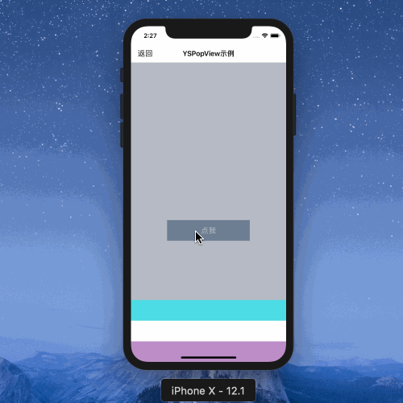

## 自定义PopView

底部弹出的PopView在实际开发中使用频率很高，今天简单实现一个组件`YSBasePopView`，希望对有需要的朋友提供帮助

>项目示例



#### 1、组件功能类

* YSBasePopView.h

```
#import "YSBaseView.h"

NS_ASSUME_NONNULL_BEGIN

typedef void(^YSPopViewDidShowBlock)(void);
typedef void(^YSPopViewDidDismissBlock)(void);

@interface YSBasePopView : YSBaseView

@property (nonatomic,copy) YSPopViewDidShowBlock didShowBlock;
@property (nonatomic,copy) YSPopViewDidDismissBlock didDismissBlock;

- (void)addContentView;

- (void)showInView:(UIView *)view;

- (void)dismiss;

@end

NS_ASSUME_NONNULL_END
```

* YSBasePopView.m

```

#import "YSBasePopView.h"

@interface YSBasePopView()

@property (nonatomic,strong) UIView *backMaskView;
@property (nonatomic,strong) UIView *contentView;

@end

@implementation YSBasePopView

#define UIColorPopBG [UIColorFromRGB(0x1F2E4A) colorWithAlphaComponent:.6]

- (instancetype)initWithFrame:(CGRect)frame{
    if (self = [super initWithFrame:frame]) {
        
        [self addSubview:self.backMaskView];
        
        [self addContentView];
        
        self.hidden = YES;
    }
    return self;
}

#pragma mark - *********** event ***********

- (void)addContentView{
    [self addSubview:self.contentView];
}

#pragma mark - *********** show & dismiss ***********

- (void)showInView:(UIView *)view{
    [view addSubview:self];
    self.contentView.top = self.height;
    self.hidden = NO;
    [UIView animateWithDuration:.3 animations:^{
        self.backMaskView.alpha = 1;
        self.contentView.top = self.height - self.contentView.height;
    } completion:^(BOOL finished) {
        if (self.didShowBlock) {
            self.didShowBlock();
        }
    }];
}

- (void)dismiss{
    [UIView animateWithDuration:.3 animations:^{
        self.backMaskView.alpha = 0;
        self.contentView.top = self.height;
    } completion:^(BOOL finished) {
        self.hidden = YES;
        if (self.didDismissBlock) {
            self.didDismissBlock();
        }
    }];
}

#pragma mark - *********** lazy ***********

- (UIView *)backMaskView{
    if (!_backMaskView) {
        _backMaskView = UIView.new;
        _backMaskView.frame = self.bounds;
        _backMaskView.backgroundColor = UIColorPopBG;
        _backMaskView.alpha = 0;
        
        UITapGestureRecognizer *tap = [[UITapGestureRecognizer alloc]initWithTarget:self action:@selector(dismiss)];
        [_backMaskView addGestureRecognizer:tap];
    }
    return _backMaskView;
}

- (UIView *)contentView{
    if (!_contentView) {
        _contentView = [[UIView alloc]initWithFrame:CGRectMake(0, 0, self.width, 200)];
        _contentView.backgroundColor = UIColor.whiteColor;
        
        UILabel *label = UILabel.new;
        label.text = @"我是一个PopView \n自定义需要重写addContentView方法";
        label.textAlignment = NSTextAlignmentCenter;
        label.numberOfLines = 0;
        [label sizeToFit];
        label.center = _contentView.center;
        [_contentView addSubview:label];
    }
    return _contentView;
}

@end
```

不难发现，这里的设计思路是针对重写addContentView方法，达到自定义效果

#### 2、示例视图类

* YSPopView.h

```
#import <UIKit/UIKit.h>
#import "YSBasePopView.h"

NS_ASSUME_NONNULL_BEGIN

@interface YSPopView : YSBasePopView

@end

NS_ASSUME_NONNULL_END
```

* YSPopView.m

```

#import "YSPopView.h"

@interface YSPopView()

@property (nonatomic,strong) UIScrollView *contentView;

@end

@implementation YSPopView

- (void)addContentView {
    [self addSubview:self.contentView];
}

#pragma mark - *********** lazy ***********

- (UIView *)contentView{
    if (!_contentView) {
        _contentView = UIScrollView.new;
        _contentView.backgroundColor = UIColor.whiteColor;
        _contentView.frame = CGRectMake(0, 300, self.width, 300);
        
        for (int i = 0; i < 10; i++) {
            UIView *view = UIView.new;
            [view setFrame:CGRectMake(0, i * 50, _contentView.width, 50)];
            view.backgroundColor = randomColor;
            [_contentView addSubview:view];
        }
        
        [_contentView setContentSize:CGSizeMake(_contentView.width, 50*10)];
    }
    return _contentView;
}

@end
```

#### 3、使用方法

```
- (void)showPopView{
    [self.popView showInView:self.view];
}

#pragma mark - *********** lazy ***********

- (YSPopView *)popView{
    if (!_popView) {
        _popView = [[YSPopView alloc]initWithFrame:self.view.bounds];
        [_popView setDidShowBlock:^{
            NSLog(@"弹窗出现");
        }];
        
        [_popView setDidDismissBlock:^{
            NSLog(@"弹窗消失");
        }];
    }
    return _popView;
}
```

### 总结

* 组件代码实现较简单，希望能帮到有需要的朋友，大家做个参考

以上均是自学过程的积累，学到哪记到哪

原创文章，转载请注明出处，谢谢！